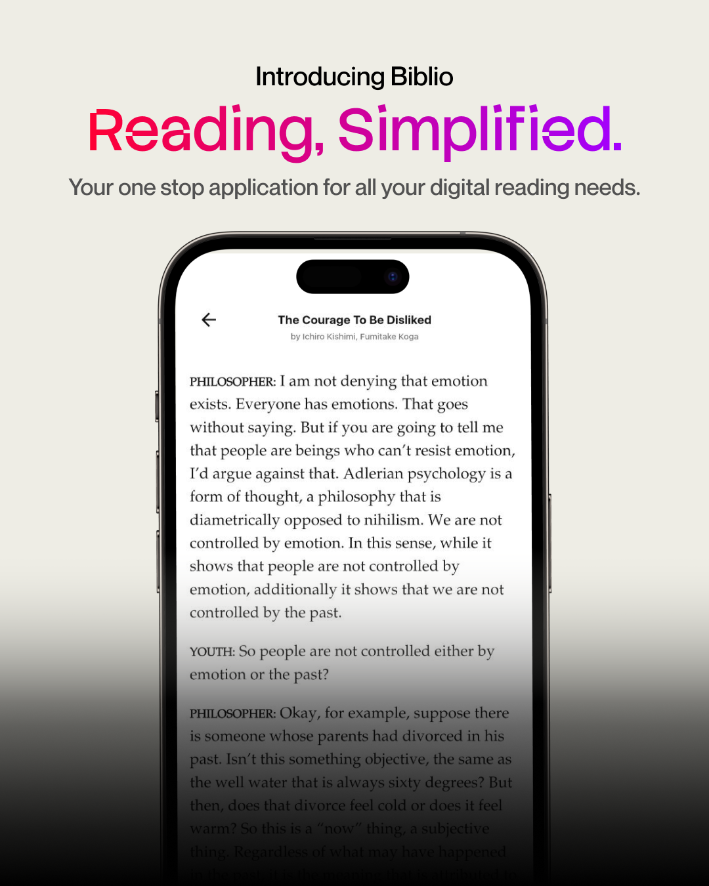
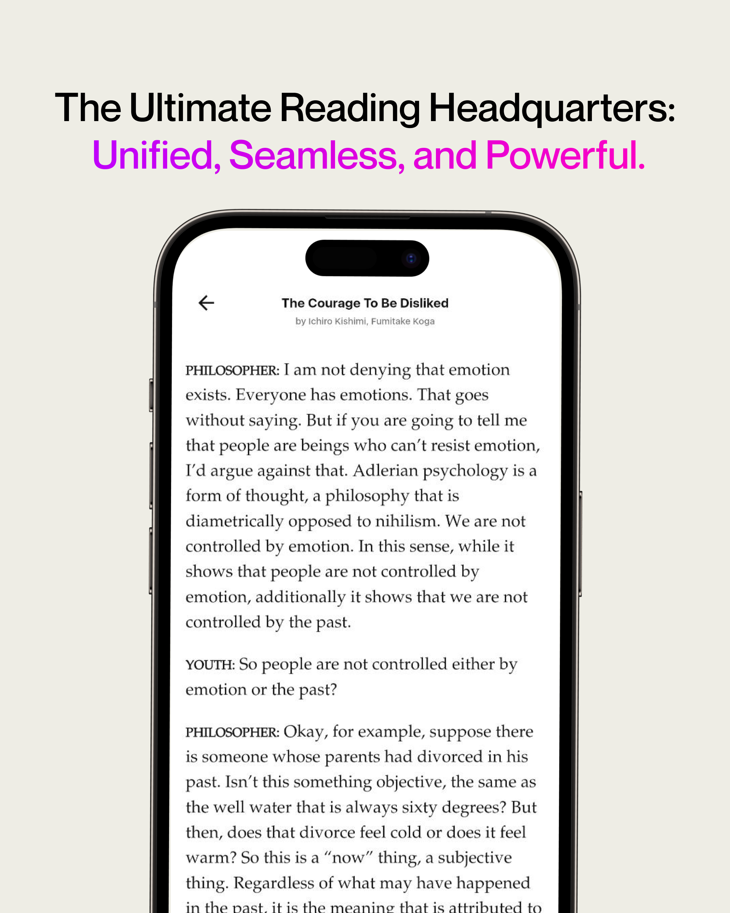
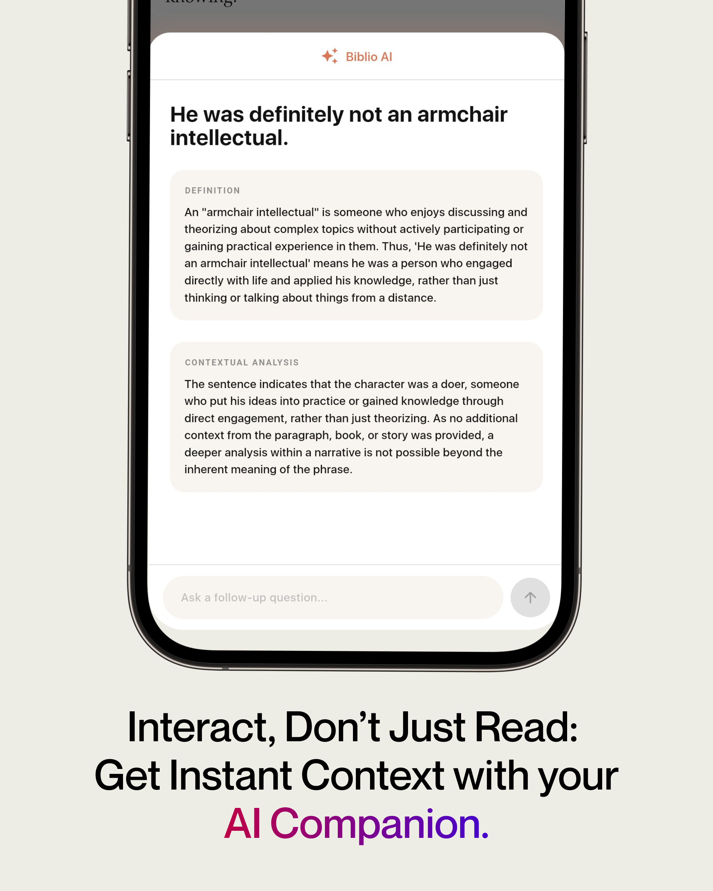
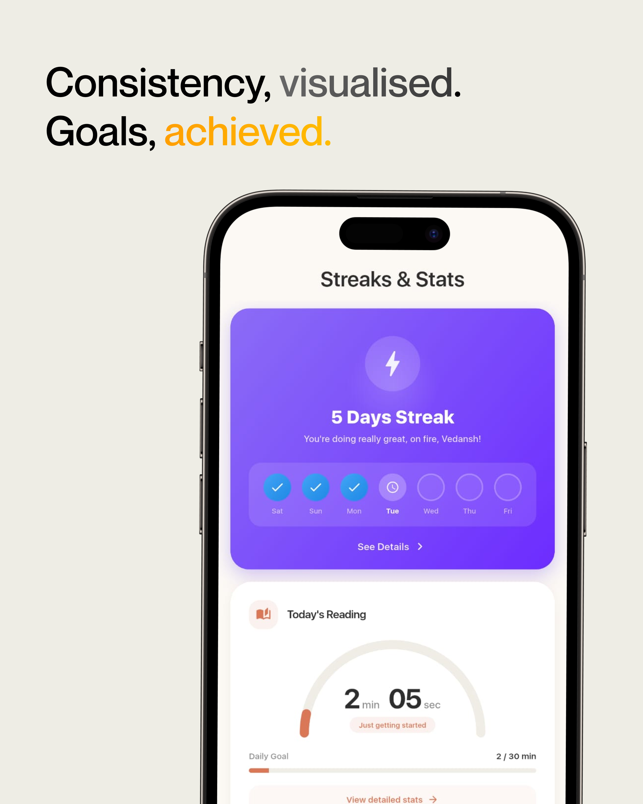
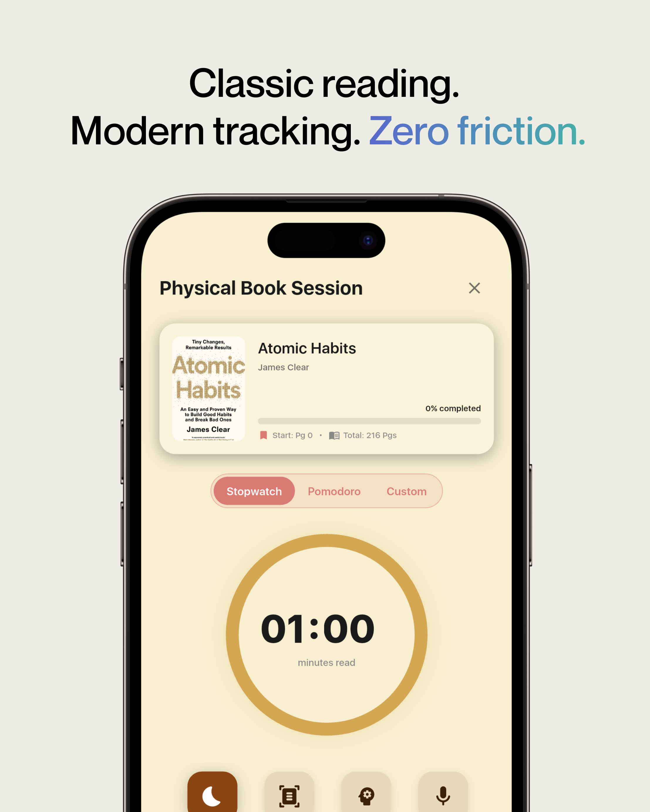
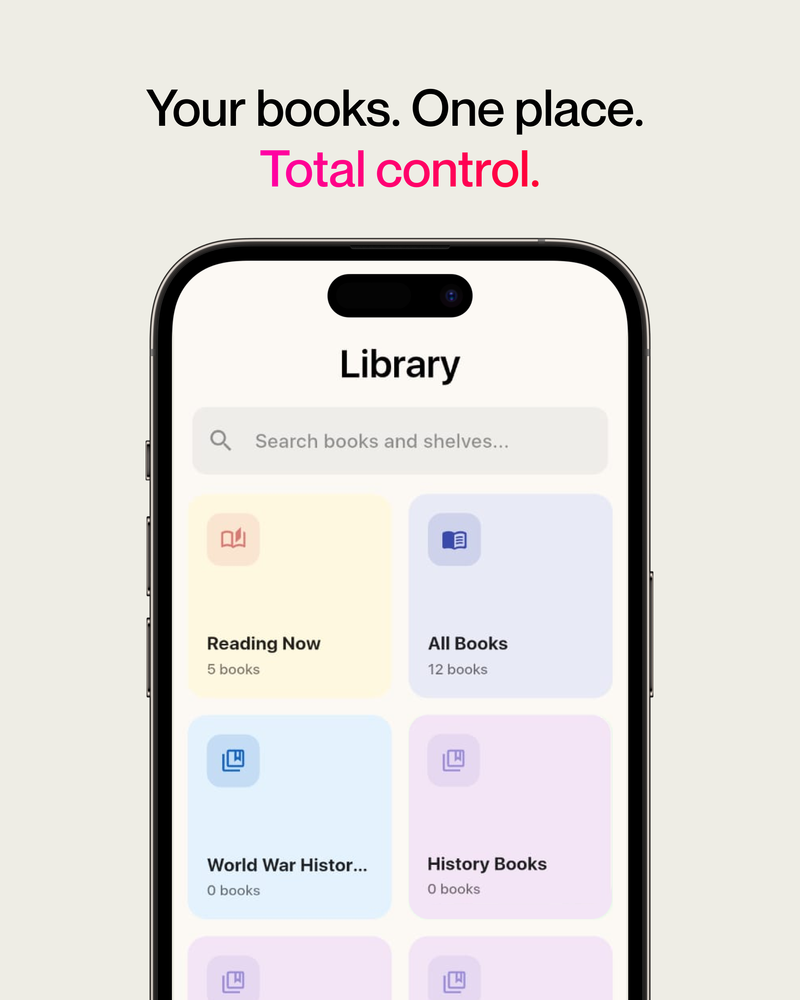

<div align="center">
  

  # Biblio

  **A digital library and reading companion for eBooks and physical books — powered by Gemini AI.**

  
  
  
</div>

---

## About

Biblio is a personal reading app that brings together everything a reader needs in one place. Track your library across digital and physical books, read PDFs and EPUBs in-app, capture quotes and highlights, and tap an AI assistant any time you hit a word, passage, or page you want explained. A built-in streak and XP system keeps the habit going.

## Features

- **Library management** — Organize PDFs, EPUBs, and physical books on custom shelves; search, sort, and bulk-edit
- **In-app readers** — PDF reader (Syncfusion) and EPUB reader with custom UI
- **AI reading assistant** (Gemini 2.5 Flash):
  - Long-press any text in an EPUB to get a definition and contextual explanation
  - Follow-up Q&A that remembers what you were reading
  - **Snap & Ask** — circle any region on a physical book page and ask AI about it
- **Quote scanning** — OCR text from physical book pages (Google ML Kit)
- **Notebook & highlights** — Save quotes, definitions, and notes
- **Reading sessions** — Timed focused sessions with session summaries
- **Gamification** — Daily streaks, XP, achievements, levels, celebration animations
- **Cloud sync** — Books, shelves, highlights, and stats sync via Supabase

## Screenshots

| | |
|:---:|:---:|
|  |  |
|  |  |
|  |  |

<div align="center">
  
</div>

## Tech stack

| Layer | Tools |
|---|---|
| Framework | Flutter (Dart ≥3.7.2) |
| State management | Riverpod 3 |
| Backend | Supabase (Auth, Postgres, Storage) |
| AI | Google Gemini 2.5 Flash |
| Local storage | Sembast, SharedPreferences, Secure Storage |
| Readers | `syncfusion_flutter_pdfviewer`, custom `flutter_epub_viewer`, `epubx` |
| Camera & OCR | `camera`, `google_mlkit_text_recognition`, `image_cropper` |
| Auth | Google Sign-In + Supabase Auth |
| Metadata | Google Books API |
| UI | `flutter_screenutil`, `google_fonts`, `flutter_native_splash` |

## Getting started

### Prerequisites

- Flutter SDK (Dart ≥3.7.2)
- A Google [Gemini API key](https://aistudio.google.com/app/apikey)
- A [Supabase](https://app.supabase.com) project (free tier works)

### Setup

```bash
git clone https://github.com/ved1nsh/Biblio.git
cd biblio
flutter pub get
```

Create a `.env` file at the repo root (copy from `.env.example`):

```bash
cp .env.example .env
```

Fill in your keys:

```dotenv
GEMINI_API_KEY=your_gemini_key
SUPABASE_URL=https://your-project.supabase.co
SUPABASE_ANON_KEY=your_supabase_anon_key
```

Then run:

```bash
flutter run
```

### Supabase setup

You'll need the following tables/buckets in your Supabase project for the app to work end-to-end:

- Tables: `user_profiles`, `user_achievements`, `books`, `shelves`, `highlights`, `notebook_entries`, `reading_stats`
- Storage bucket: `book_covers`
- Auth: Google provider enabled (for Google Sign-In)

> Schema files / migrations are not yet checked in. If you want to use Biblio as a base for your own app, you'll need to recreate the schema based on the models in [lib/core/models/](lib/core/models/).

## Project structure

```
lib/
├── main.dart
├── core/                 # Shared services, providers, models
│   ├── services/         # AI, Supabase, Sembast, XP, achievements, etc.
│   ├── providers/        # Riverpod providers
│   └── models/
├── Homescreen/           # Dashboard with Library, Notebook, Streak, Socials tabs
├── pdf_viewer/           # PDF reader
├── epub_viewer/          # EPUB reader + AI definition sheet
├── reading_session/      # Timed reading sessions
├── manual_reading/       # Physical book features (Snap & Ask, Scan Quote)
├── features/
│   ├── gamification/     # Achievements, levels, streaks, stats
│   └── settings/
├── onboarding/
└── auth/

packages/
└── flutter_epub_viewer/  # Custom EPUB viewer package
```

## Platforms

- ✅ **Android** — fully configured
- ✅ **iOS** — Coming Soon


## Roadmap

- [ ] Socials tab (reading communities, friends, leaderboards)
- [ ] Integrate Push Notifications
- [ ] In app PDF to EPUB Converstion.

## Contributing

PRs welcome. Please open an issue first to discuss anything non-trivial.

## Acknowledgments

- [Google Gemini](https://deepmind.google/technologies/gemini/) for the AI backbone
- [Supabase](https://supabase.com) for auth + database
- [Syncfusion Flutter Widgets](https://www.syncfusion.com/flutter-widgets) for PDF rendering
- [flutter_epub_viewer](https://pub.dev/packages/flutter_epub_viewer) — vendored and customized
